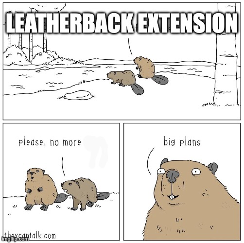

<!-- # leatherback.example.interactive -->
[](https://docs.python.org/3/whatsnew/3.11.html)

[](https://releases.ubuntu.com/22.04/)
[](https://docs.isaacsim.omniverse.nvidia.com/5.1.0/index.html)

<!-- PROJECT LOGO -->
<br />
<div align="center">
  <a href="https://github.com/boredengineering/goatracer.one.interactive">
    
  </a>

  <h3 align="center">GoatRacer One Interactive</h3>

  <p align="center">
    An awesome template to jumpstart your IsaacSim projects !
    <br />
    <a href="https://github.com/boredengineering/goatracer.one.interactive"><strong>Coming Soon -- Explore the docs »</strong></a>
    <br />
    <br />
    <a href="https://github.com/boredengineering/goatracer.one.interactive/issues">Report an Issue</a>
    &middot;
    <a href="https://github.com/boredengineering/goatracer.one.interactive/discussions">Request Feature</a>
  </p>
  
</div>
<!-- Description: This extension allows you to play a 3rd person videogame with your real robot -->

# Intro

This Omniverse Extension works as an example that shows how to run a policy in IsaacSim for a F1Tenth car based on the project Leatherback. The policy is trained on IsaacLab and further deployed on IsaacSim.


## Dependencies

This extension depends on ONNX runtime which will be automatically installed, also check IsaacSim and IsaacLab for training the policies.

- [IsaacLab](https://github.com/isaac-sim/IsaacLab)
- [IsaacSim](https://github.com/isaac-sim/IsaacSim)


## Getting Started

To enable this extension, go to the Extension Manager menu and enable goatracer.one.interactive extension.

**Manual installation**

Go to the Extension Manager and in the drop down menu select Settings and add the path to the folder where the extension is located.

Example:

```bash
/home/user/Documents/GitHub/boredengineer
```

The extension manager will automatically look for extension with the name leatherback.example.interactive

## Usage

Step 1: Click on the viewport with the left mouse button to select the environment

Step 2: Use the middle mouse button to generate the waypoints


<!-- PROJECT Meme -->
<br />
<div align="center">
  <a href="https://github.com/boredengineering/leatherback.example.interactive">
    
  </a>

  <h3 align="center">BIG PLANS !!!</h3>
  
</div>

## Acknowledgement

If you find this work useful for your research/project, please be so kind to give a star and citing this work.

```bibtex
@misc{GoatRacerOneInteractive,
  author       = {RWS},
  title        = {GoatRacer One Interactive},
  year         = {2025},
  publisher    = {GitHub},
  journal      = {GitHub repository},
  howpublished = {\url{https://github.com/boredengineering/goatracer.one.interactive}},
}
```
